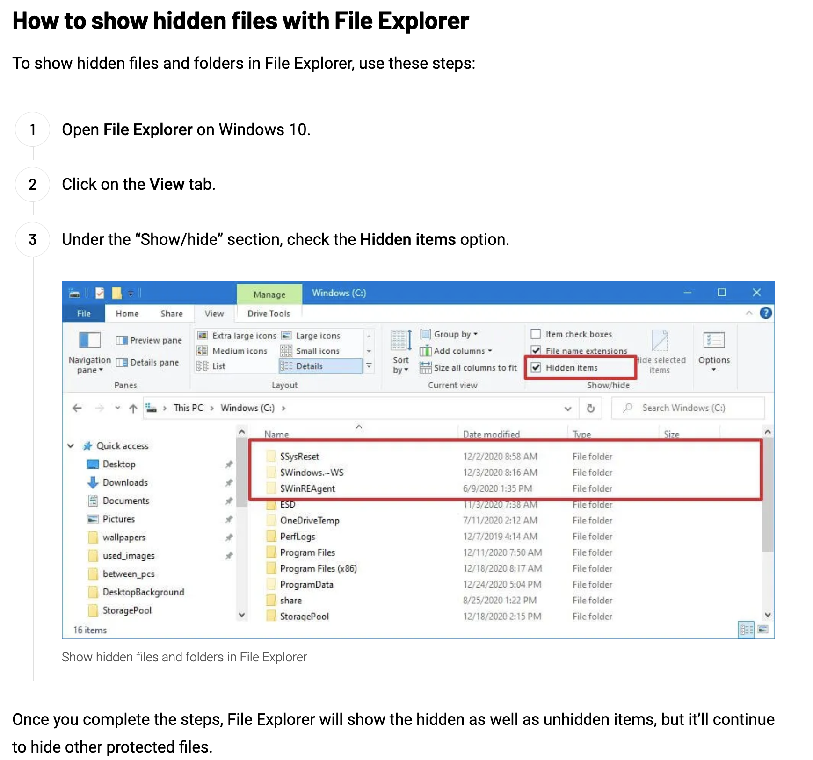

# How to Install Git
This section explains how to isntall Git on your local environment (desktop/laptop/virtualmachine).

## Installing Git

## Windows Hidden Files
1. https://pureinfotech.com/show-hidden-files-folders-windows-10/
2. 
3. 
4. 
5. 
